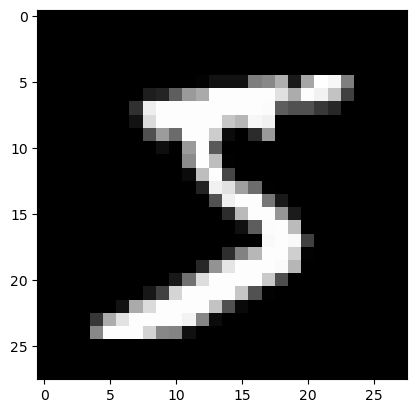
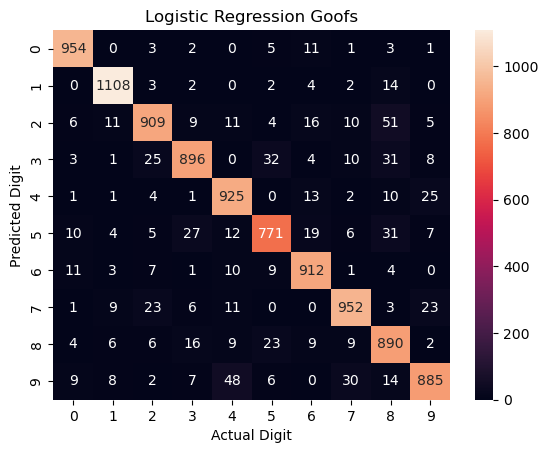
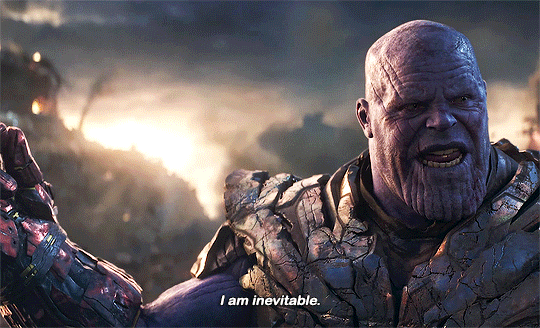
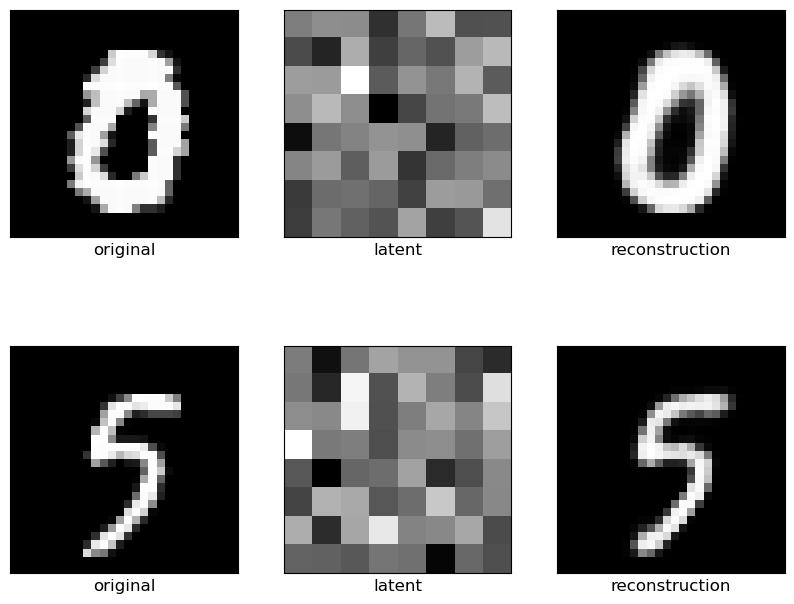
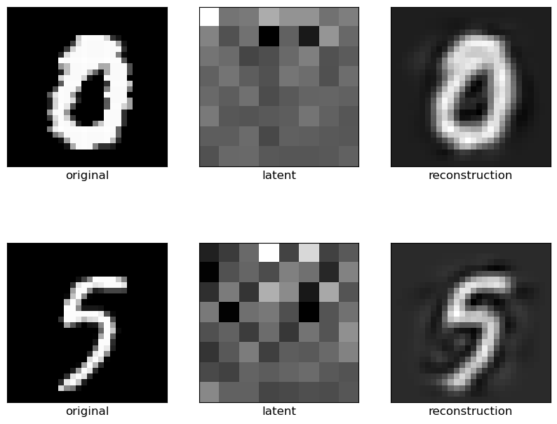
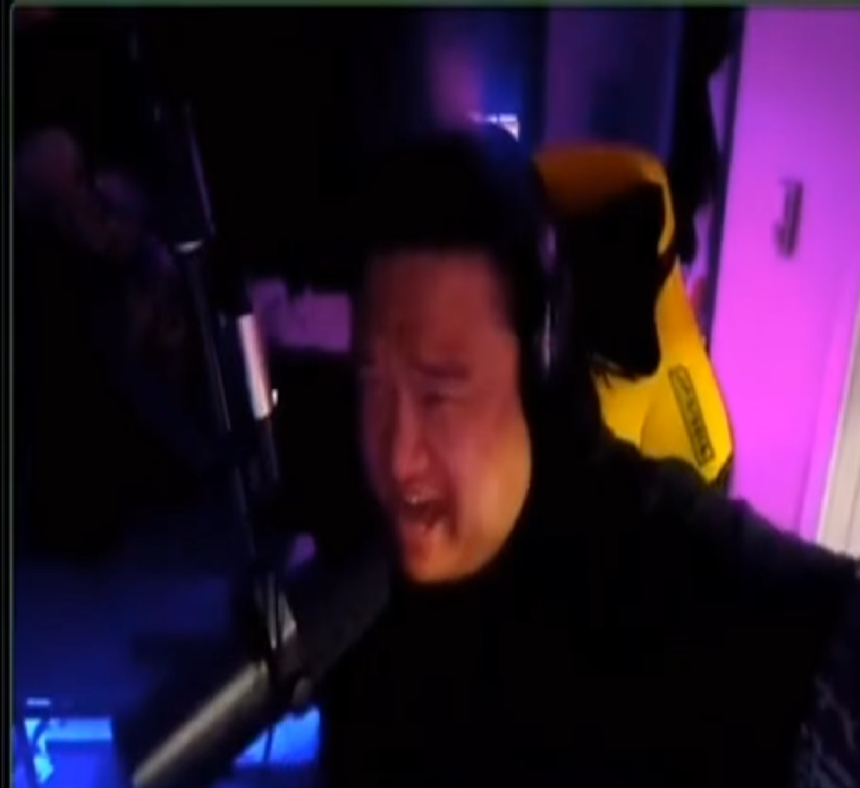

# And that's what you missed on Glee!
As an aside, I got my report card a few days ago! Because I didn't fail three or more classes this past semester, after four sorta-fun semesters and with a thoroughly mediocre 3.2 GPA, I've officially completed the requirements for the BS in Computer Science. 

Today, we've got a quick demo of a basic variant of my favorite neural network architecture. The accompanying notebook is on my GitHub: 

# BYE SISTER, but for PCA
In my internship this past semester (part-time, for-credit, that the CS department was nice enough to hook me up with), we were working for the NOAA on a pretty open-ended analysis task involving noisy, high-dimension, and sparse computational biology data with complex nonlinear interactions between features. The data was giving the tools the biologists were familiar with some trouble. Our boss said that principal component analysis, which is a linear dimensionality reduction technique, was the tool people in the domain used for this task and pointed us to it as a reasonable starting point.

However, for the aformentioned reasons, the data was "real-life" enough that PCA didn't work; after substantial amounts of time spent attempting to _make it work_, we concluded that it just wasn't going to, and that neural networks would be a better approach. In hindsight, an intern team getting to do whatever they thought was interesting was pretty kickass.

> In all seriousness, in my limited experience goofing off on Kaggle datasets, PCA _probably doesn't work_ too well in general, considering that it doesn't work even on clean Kaggle data. 

What _did_ work for our task was autoencoder varieties, which are neural network-based, nonlinear generalizations of PCA. After our "custom" pipeline of "sophisticated" (standard NLP-inspired stuff, again from our computational backgrounds, which I suppose were novel for tabular biology datasets) data transformation and dimension reduction, the data analysis task was trivial for the biologists we were working for.

After taking a look through both the literature and Reddit, I have a suspicion that data practicioners underrate search-based data analysis methods, particularly autoencoders, probably due to their "black box" nature. No one's talking about actually using this sort of thing, and they worked great for us!

Today, we're going to be demoing the ability of autoencoders to automagically engineer good, real-life, __nonlinear__ features for linear models, which are more interpretable: we'll get the power of computational methods and the speed, elegance, and interpretability of linear models. To simulate the high-dimension, noisy, sparse nature of real-world tabular data, we'll be using the MNIST dataset, which consists of 784 numerical input variables and one categorical response variable (of 10 possible classes).

# What is the MNIST dataset? Why not just use the data from your internship?
MNIST is a dataset of 28x28 handwritten digits. It's commonly used to benchmark machine learning algorithms. The 784 features for each datapoint are the 784 pixels in each image (from 28*28=784), and each feature's value is how dark it was in the grayscale image. They look like this:



I'm not going to use my internship's data because it's not mine to show off on the internet, but like MNIST, the data was noisy and featured interactions between features (columns) that affected a datapoint's label. In a handwritten digit, the pixels' values _also_ interact with each other to change what digit an image represents. For that reason, I think MNIST is a good proxy for my internship data: both have complex relationships between input variables that affect the response. While the internship data had 90,000 features per datapoint and 2,000 datapoints, making it even messier than the image data we'll be working with today, I think it's a reasonable proxy that doesn't require spending too much time wrangling.

# Methodology
Our methodology is going to be:

1. Import the data, which is already split into working (60,000) and testing (10,000) sets in a 6:1 ratio. To simulate real-world generalization, we'll be working with the working set, only testing on the testing set once we have a completed, tuned model.
1. Fit a logistic regression model to the entire working set and evaluate its results on the testing set. I expect this to be on the order of 90% accuracy.
1. Preprocess the data with the standard PCA dimension reduction thing. I don't expect this to increase accuracy. PCA sucks.
1. Build and train a powerful deep learning-based classification model called a convolutional neural network on it, which is the most powerful black box model with the best-suited inductive bias for this task. The goal is to showcase how sacrificing explainability with search-based methods can yield outrageous performance. I'm expecting around 97% accuracy here.
1. Build and train an autoencoder, so as to reduce the dimension of the data in a more sophisticated, modern way. 
1. Train a new linear classifier on the autoencoder-processed data. Hopefully, this will get us to around 93%. 

Along the way, we'll provide some visualizations to help us get a handle on what's happening.

# Naively-fit Linear Classifier
First, just using a Python library, we'll fit a simple linear classifier to the raw data with an epoch of stochastic gradient descent. We won't use any regularization: I have a suspicion that lasso regularization would make the model "ignore" "unimportant" pixels and greatly increase performance-- this is about nonlinear dimensionality reduction, not logistic regression hyperparameter tuning. That got us 92.6% performance after fitting for 18 seconds; here's where the model screwed up along the way.



# PCA + Naively-fit Linear Classifier
I shrank the data down to 8x8 (from 28x28 originally) with PCA. That got us 91.7% performance after fitting for 0.18 seconds. I don't think it's worth discussing because accuracy went _down_; shrinking down to 10x10 and 20x20 was similarly bad.

# That's not a knife: Convolutional Neural Network
At first glance, over 90% accuracy for handwritten digits might still seem pretty good, but I promise that's pretty poor for this dataset. Now, we'll break out the big guns and get _over 99%_ accuracy with a convolutional neural network, which is a black box model that generally _kicks ass_ at this sort of task.

> How a CNN works is out of the scope of this notebook; the goal here is to show what's a "good" accuracy: no GPU, no Apple Silicon (this is an eight year-old ThinkPad), and just a few minutes of training. I did architecture and hyperparameter tuning off camera (several months ago, when I learned what CNNs are in class).

There aren't many prebuilt neural networks, so I built this one using a deep learning framework called PyTorch. Here's some relevant code snippets:

```py
class SimpleCNN(nn.Module):
    def __init__(self):
        super().__init__()
        self.conv1 = nn.Conv2d(1, 16, kernel_size=3, stride=1, padding=1)
        self.relu1 = nn.ReLU()
        self.pool1 = nn.MaxPool2d(kernel_size=2, stride=2)
        self.conv2 = nn.Conv2d(16, 32, kernel_size=3, stride=1, padding=1)
        self.relu2 = nn.ReLU()
        self.pool2 = nn.MaxPool2d(kernel_size=2, stride=2)
        self.dropout = nn.Dropout(0.25)
        self.fc1 = nn.Linear(7 * 7 * 32, 128)
        self.relu3 = nn.ReLU()
        self.dropout2 = nn.Dropout(0.5)
        self.fc2 = nn.Linear(128, 10)

    def forward(self, x):
        x = self.pool1(self.relu1(self.conv1(x)))
        x = self.pool2(self.relu2(self.conv2(x)))
        x = x.view(-1, 7 * 7 * 32)
        x = self.dropout(x)
        x = self.relu3(self.fc1(x))
        x = self.dropout2(x)
        x = self.fc2(x)
        return x
        
# reshaping to be in grids again to play nice with convolution
X_tr_pt = torch.from_numpy(X_tr.reshape(-1, 1, 28, 28)).float()
X_te_pt = torch.from_numpy(X_te.reshape(-1, 1, 28, 28)).float()
train_loader = DataLoader(TensorDataset(X_tr_pt, Y_tr_pt), batch_size=64, shuffle=True)

LEARNING_RATE = 0.001
EPOCHS = 10
model = SimpleCNN()
crit = nn.CrossEntropyLoss()
adam = optim.Adam(model.parameters(), lr=LEARNING_RATE)

train_start = time.time()
for epoch in tqdm(range(EPOCHS)):
    ep_start = time.time()
    model.train()
    ep_loss = 0.0
    for x, y in train_loader:
        adam.zero_grad()
        preds = model(x)
        loss = crit(preds, y)
        loss.backward()
        adam.step()
        ep_loss += loss.item()
    ep_end = time.time()
    print(f'Epoch {epoch + 1}/{EPOCHS}: Loss = {ep_loss/len(train_loader):.2f} in {ep_end - ep_start:.2f}s')
train_end = time.time()

with torch.no_grad():
    out = loaded_model(X_te_pt)
    _, preds = torch.max(out, 1)
model_acc = 100 * ((preds == Y_te_pt).sum().item() / len(preds)) # functional!
```

Overall, this fit in under four minutes and achieved 99.1% accuracy. That's an undeniable improvement over the linear model: it should show that we can do much better than 92%.



For reference, the best any lab's gotten is 99.87%: `https://paperswithcode.com/sota/image-classification-on-mnist`.

# Autoencoders
Now, let's see if we can increase the accuracy of a linear model by doing _nonlinear_ dimension reduction. An autoencoder is a neural network that learns the best way to "squish" high-dimensional data down into a lower-dimensional space _without losing information_, based on how well it can reconstruct the original input from that "squished" representation. 

I also had to build this from scratch in PyTorch, and I made it with a nice `sklearn`-like `fit_transform()` API. I'm using the Leaky ReLU for my hidden activation functions because I've found better results in the past with it (once...) than plain old ReLU. I made this one to be pretty simple, unlike the CNN; I didn't use dropout or any other freaky stuff.

Again, here's the code:

```py
class Autoencoder_64(nn.Module):
    def __init__(self):
        super().__init__()
        # this is what "squishes"
        self.encoder = nn.Sequential(
            nn.Linear(28 * 28, 512),
            nn.LeakyReLU(),
            nn.Linear(512, 256),
            nn.LeakyReLU(),
            nn.Linear(256, 128),
            nn.LeakyReLU(),
            nn.Linear(128, 64),
        )
        
        # this is what "stretches"
        self.decoder = nn.Sequential(
            nn.Linear(64, 128),
            nn.LeakyReLU(),
            nn.Linear(128, 256),
            nn.LeakyReLU(),
            nn.Linear(256, 512),
            nn.LeakyReLU(),
            nn.Linear(512, 28 * 28),
            nn.Sigmoid(),
        )

    def forward(self, x):
        encoded = self.encoder(x)
        decoded =  self.decoder(encoded)
        return decoded
    
    # x is the numpy array, already flattened and normalized
    def fit(self, x, epochs=10, learning_rate=0.001, verbose=True):
        self.train()
        loader = DataLoader(torch.from_numpy(x).float(), batch_size=64, shuffle=True)
        adam = optim.Adam(self.parameters(), lr=learning_rate)
        crit = nn.MSELoss()
        train_start = time.time()
        for epoch in tqdm(range(epochs)):
            ep_start = time.time()
            ep_loss = 0.0
            for x in loader:
                adam.zero_grad()
                reconstructed = self(x)
                loss = crit(x, reconstructed)
                loss.backward()
                adam.step()
                ep_loss += loss.item()
            ep_end = time.time()
            if verbose:
                print(f'Epoch {epoch + 1}/{epochs}: Loss = {ep_loss/len(loader):.2f} in {ep_end - ep_start:.2f}s')
        train_end = time.time()
        if verbose:
            train_mins = int((train_end - train_start) // 60)
            train_secs = int((train_end - train_start) % 60)
            fname = 'ae_64.pth'
            print(f'Finished training in {train_mins}:{train_secs}.')
            print(f'Saving as {fname}.')
        torch.save(self, fname)
        return self

    # takes in and outputs numpy
    def transform(self, x):
        self.eval()
        with torch.no_grad():
            out = self.encoder(torch.from_numpy(x).float()).numpy()
        return out
    
    def fit_transform(self, x, epochs=10, learning_rate=0.001, verbose=True):
        self.fit(x, epochs=epochs, learning_rate=learning_rate, verbose=verbose)
        out = self.transform(x)
        return out
    
    def reconstruct(self, x):
        self.eval()
        with torch.no_grad():
            x_tensor = torch.from_numpy(x).float()
            out = self(x_tensor).numpy()
        return out
```

Let's take a look at the 8x8 images the autoencoder made, as well as its reconstructions. As you can see, while the squished representations don't look like a 5 or a 0, you can see from the reconstructions that the model did successfully learn a squished representation that captures important information!



Here's PCA doing the same thing, for reference. You'll see that the reconstruction is much lower-quality: you, as a human, can see what the digits are, but the weird, swirly patterns around the edges, as well as the gray background, clearly were throwing the model off.



With the autoencoder automatically engineering nonlinear features, the linear classifier achieved __94.2% accuracy__.

# Conclusion


I think that there's plenty more gains to be had. I made the autoencoder, which was the core of this little inference pipeline, in a pretty careless fashion:

- I legitimtately didn't do any kind of architecture or hyperparameter tuning-- I just said "yeah, this is definitely an autoencoder,"
- I just used a standard autoencoder; there are more powerful varieties, _and_ 
- I didn't include any supervised aspect (including a classifier's predictions in the loss when training), which would allow _even more accurate_ reconstructions.

But I think that I was able to show that autoencoders are capable of automatically engineering useful features for linear models in a way that principal component analysis isn't. Thanks for reading!
